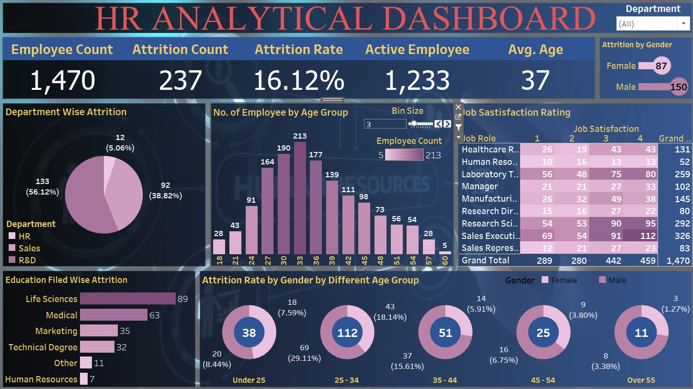

# HR Analytics Dashboard

## Screenshot

## Overview

Welcome to the HR Analytics Dashboard! 📊 This dashboard provides comprehensive insights into employee data, focusing on attrition, demographic information, job characteristics, and more. It aims to facilitate data-driven decision-making for HR professionals and business leaders.

## Features

- **Interactive Data Visualizations:** Explore and analyze employee data through dynamic charts and graphs.
- **Filter and Drill Down:** Utilize filters to investigate attrition rates, employee demographics, job roles, and other relevant factors.
- **User-Friendly Interface:** Designed for HR professionals and business leaders to easily navigate and derive insights from the data.

## Technologies Used

- **Data Visualization Tools:** Utilizing tools like Tableau or Power BI for creating interactive and informative visualizations.
- **Employee Dataset:** Leveraging a dataset containing comprehensive employee information across various dimensions.
- **Analytics:** Applying analytical techniques to uncover trends, patterns, and correlations within the employee data.

## Getting Started

### Prerequisites

- Access to the HR Analytics Dashboard platform (Tableau, Power BI, etc.) for viewing and interacting with the dashboard.

### Accessing the Dashboard

1. Access the dashboard via the provided link or download the dashboard file (if applicable).
2. Open the dashboard using the respective analytics tool (Tableau, Power BI, etc.).
3. Interact with filters and visualizations to explore different aspects of employee data and HR metrics.

## Explore the Dashboard

1. **Attrition Analysis:** Investigate attrition rates and reasons across different employee demographics and job roles.
2. **Demographic Insights:** Explore employee demographics such as age, gender, education level, and marital status.
3. **Job Characteristics:** Analyze job-related metrics including job satisfaction, performance ratings, tenure, and more.

## Findings

Upon analyzing the data, several insights may be uncovered:

- **Attrition Trends:** Identify factors contributing to attrition and retention within the organization.
- **Demographic Patterns:** Understand how demographics impact various HR metrics and employee outcomes.
- **Job Role Analysis:** Evaluate job satisfaction, performance ratings, and career progression among different job roles.

## Contributing

If you have suggestions for enhancing the dashboard or adding new features, please feel free to contribute or provide feedback.

## License

This project is available under the MIT License.

## Acknowledgments

Special thanks to the team for their efforts in developing and maintaining the HR Analytics Dashboard.
